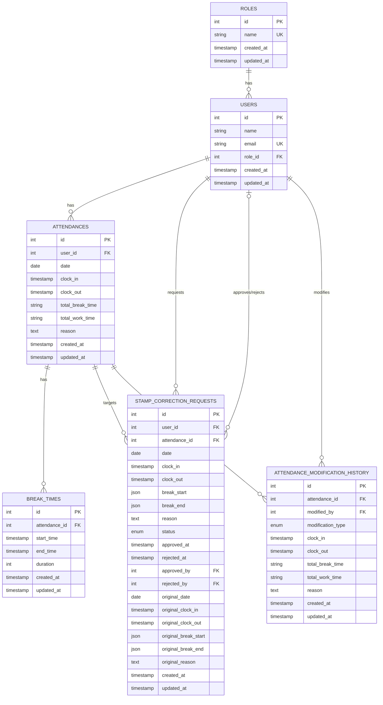

# coachtech 勤怠アプリ

このアプリケーションは、従業員の勤怠打刻、休憩管理、修正申請を行うための勤怠管理システムです。

## 環境構築 (Docker)

### 必要なもの

- Docker
- Docker Compose

### 手順

1.  **リポジトリのクローン:**

    ```bash
    git clone [リポジトリのURL]
    cd [クローンしたディレクトリ名]
    ```

2.  **環境変数の設定:**
    `.env.example` ファイルをコピーして `.env` ファイルを作成し、必要に応じてデータベース接続情報などを編集します。

    ```bash
    cp .env.example .env
    ```

3.  **Docker コンテナのビルドと起動:**

    ```bash
    docker-compose up -d --build
    ```

    - _注意:_ MySQL コンテナは、お使いの OS や環境によっては正常に起動しない場合があります。その場合は、`compose.yaml` ファイル内の MySQL サービス定義（ポートやボリュームなど）を適宜調整してください。

4.  **PHP コンテナへのアクセス:**

    ```bash
    docker-compose exec php bash
    ```

5.  **(PHP コンテナ内) Composer パッケージのインストール:**

    ```bash
    composer install
    ```

6.  **(PHP コンテナ内) アプリケーションキーの生成:**

    ```bash
    php artisan key:generate
    ```

7.  **(PHP コンテナ内) データベースマイグレーション:**

    ```bash
    php artisan migrate
    ```

8.  **(PHP コンテナ内) データベースシーディング (テストデータの投入):**

    ```bash
    php artisan db:seed
    ```

9.  **コンテナからの退出:**
    ```bash
    exit
    ```

これで環境構築は完了です。

## 使用技術

- **PHP:** php:8.2
- **フレームワーク:** Laravel 11.x
- **データベース:** mysql:8.0.39
- **Web サーバー:** nginx:1.27.2
- **コンテナ仮想化:** Docker, Docker Compose

## ER 図



## URL

- **開発環境:** [http://localhost/](http://localhost/)
- **phpMyAdmin:** [http://localhost:8080/](http://localhost:8080/) ( `compose.yaml` でポートが変更されている場合は調整してください)

## ログイン情報 (シーディング後)

- **管理者ユーザー:**

  - メールアドレス: `admin@example.com`
  - パスワード: `adminpass`

- **一般ユーザー:**
  - メールアドレス: `test@example.com`
  - パスワード: `testpass`

## テスト

このプロジェクトでは、アプリケーションの品質を保証するために PHPUnit を使用したテストスイートが含まれています。

### テストの実行方法

1.  **Docker コンテナ内に入る:**

    ```bash
    docker-compose exec php bash
    ```

2.  **(PHP コンテナ内) テストを実行する:**

    ```bash
    php artisan test
    ```

    特定のテストファイルのみを実行したい場合は、ファイルパスを指定します。

    ```bash
    php artisan test tests/Feature/Auth/AuthenticationTest.php
    ```

    特定のメソッドのみを実行したい場合は、`--filter` オプションを使用します。

    ```bash
    php artisan test --filter=login_fails_when_email_is_missing
    ```

### テストの内容

`tests/` ディレクトリには、以下の種類のテストが含まれています。

- **Feature テスト (`tests/Feature`):** アプリケーションの主要な機能（認証、勤怠打刻、修正申請、管理者機能など）に関するエンドツーエンドに近いテスト。

  - `Auth/`: ログイン、登録、管理者認証などの認証関連テスト。
  - `Attendance/`: 一般ユーザー向けの勤怠打刻、休憩、一覧表示、詳細表示、修正申請に関するテスト。
  - `Admin/`: 管理者向けのスタッフ一覧、勤怠一覧、勤怠詳細/更新、修正申請の承認/却下に関するテスト。
